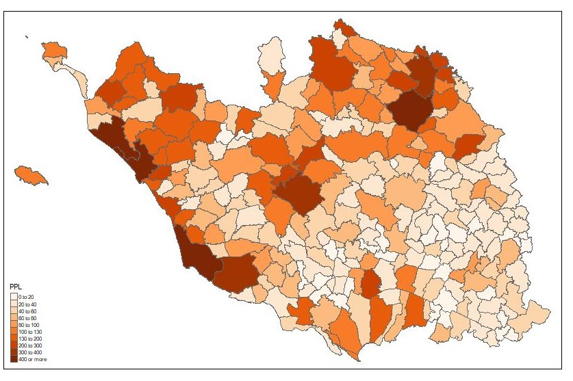

# Geographie_Electorale_France

## Objet de l'analyse

Ce projet est une étude géostatistique du vote des Français en utilisant les modèles bayésiens

## Dossier data

Dans ce projet, les données utilisées pour les variables explicatives viennent de l'Insee : 

https://www.insee.fr/

La liste des tableaux disponibles de l'Insee est dans le fichier doc_RP.xlsx.

Les tableaux qui ont été utilisés pour cette étude :
- Population active de 15 ans ou plus par sexe, âge et type d'activité
- Population par sexe, âge et situation quant à l'immigration
- Population par sexe et âge regroupé

Les données utilisées pour les variables dépendantes viennent de data.gouv.

Les tableaux qui ont été utilisés sont :
- Presidentielle2012ResultatsCommunesTour1Tour2.xlsx
- Presidentielle2017ResultatsCommunesTour1.xlsx
- Presidentielle2017ResultatsCommunesTour2.xlsx

Les données Presidentielle2012ResultatsCommunesTour1Tour2.xlsx ont dû être transformées pour 
obtenir un fichier avec pour chaque colonne les résultats d'un seul candidat.
La fonction utilisée pour cette transformation est dans le fichier Transformer_Presidentielle2017ResultatsCommunesTour1_ParCandidat.txt.
Le résultat est le fichier Presidentielle2017ResultatsCommunesParCandidatTour1.xlsx

## Dossier shapefile 

Vous pouvez récupérer le shapefile de la France sur data.gouv :

https://www.data.gouv.fr/en/datasets/decoupage-administratif-communal-francais-issu-d-openstreetmap/

Prendre le "Export simple du 1er janvier 2020 (222Mo), le décompresser et le mettre dans le dossier shapefile 

## Dossier init

Pour cette étude, on s'est restreint au département de la Vendée. C'est un choix qui a été motivé par le fait
que la Vendée est historiquement une terre de droite et qu'il est intéressant de voir son évolution politique
au regard des évolutions contemporaines.

Dans ce dossier, on initialise le shapefile de la Vendée, les résultats aux éléctions de 2012 et 2017 et les
données sociaux économiques.

## Dossier model

Ce dossier contient l'ensemble des modèles de cette étude.

Les modèles sont librement inspirés de "Bayesian Disease Mapping: Hierarchical Modeling in Spatial Epidemiology" de Andrew B. Lawson.

Les deux idées principales de ces modèles sont :
1) Simuler le nombre de votes dans une commune par une distribution de Poisson en modélisant le paramètre lambda de la distribution par 
              lambda = E . Theta
   avec E = nombre de votes attendus pour une commune avec x nombre d'habitants 
   et Theta = taux relatif de vote par rapport à ce qui est attendu.

Exemple : si dans une commune on a un nombre de votes attendus pour le candidat de 500 personnes et que Theta = 0.8, alors la commune a voté 20% en
dessous de ce qui était attendu.
La variable E est une donnée d'entrée du modèle. On la calcule en utilisant les résultats nationaux pour chaque candidat en groupant les votes par taille (nb d'habitants)
de commune. Ainsi on peut déterminer pour chaque taille de commune le nombre de votes attendus pour chaque candidat.
Le paramètre Theta est le coeur de l'étude et peut être modélisé de différentes manières. 

2) Cette étude est d'abord une étude géographique et donc il faut intégrer la dimension spatiale dans les modèles, c'est pourquoi on notera dans cette étude l'utilisation :
- du Conditional Autoregressive Model 
- de l'analyse multiéchelle
- de la matrice de covariance spatiale

## Script

Pour chaque modèle on trouvera un script correspondant. Le script met en forme les données, calcule tout ce qui est nécessaire au modèle et appelle WinBugs pour
lancer l'analyse bayésienne.
À la fin de chaque script le "mean squared predictive error (MSPE)" et le "widely applicable information criterion (WAIC)" sont calculés. 

## Erreurs Prédictives Postérieures EPP

1) Modèle Poisson Log Linéaire

Modèle classique peu performant

2) Modèle Latent Mixture 

La classification en groupes non observés du vote Macron et Lepen au 2eme tour de la présidentielle de 2017 n'a pas été concluante. Le modèle n'arrive pas à bien distingué entre un vote Lepen et un vote Macron.
Les erreurs prédictives pour le vote Lepen sont :

3) Modèle Multiscale

L'approche multi-échelle est très intéressante, elle permet de modéliser l'intéraction entre le niveau micro et macro :

À approfondir, le graphique des erreurs prédictives est :

4) Modèle multi-variable 

L'idée est de modéliser l'intéraction entre le vote Macron ,LePen et Fillon au 1er tour de l'élection présidentielle de 2017 sur le département de la vendée.
Pour Fillon la distribution des erreurs prédictives est :

## Références

- Bayesian Disease Mapping: Hierarchical Modeling in Spatial Epidemiology de Andrew B. Lawson
- Statistical Rethinking: A Bayesian Course with Examples in R and Stan de Richard McElreath
- Applied Spatial Data Analysis with R de Roger Bivand
- L'invention de la France de Emmanuel Todd et Hervé Le Bras 

